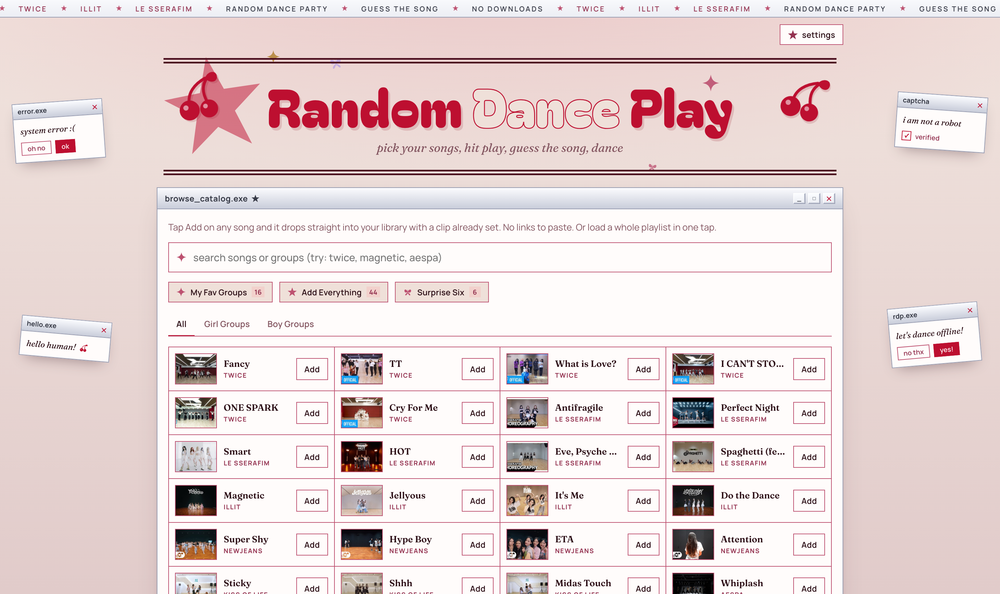

<p align="center">
  
</p>

# ⋆˚✩ random dance play ✩˚⋆

a little web app for random play dance. it shuffles clips of official k-pop dance-practice videos (no lyrics, so you can actually dance along), hides the song name for a few seconds so you can guess, then reveals it and moves on to the next one. fun solo or with a group, and it casts to a tv by casting the browser tab.

no accounts, no backend, no build step, nothing to download. playback runs through the official youtube iframe player api and your library lives in the browser. a weekend-project kind of thing, built because it sounded fun.

♫ run it and open [localhost:8000](http://localhost:8000) (see [run it](#-run-it) below)

˗ˏˋ ꒰ ♡ ꒱ ˎˊ˗

## ♫ what it does

- your setlist and the play button sit up top; the browse catalog is right below.
- browse a built-in catalog of k-pop songs (twice, illit, le sserafim, newjeans, aespa, ive, and more) and one-tap add. each song comes with a clip already set, so you can play right away with nothing to type. added songs float to the top of the catalog.
- or paste any youtube link for songs that aren't in the catalog.
- two per-song marks: tap the star to favorite a song, or the check to mark it full song known (you know it start to finish). filter the catalog by faves / full song known / girl / boy groups and sort by group or a–z.
- marking a song full song known doesn't change how it plays on its own. it unlocks a chorus / full song toggle on that song in your setlist, defaulting to the short clip, so you decide which known songs actually play their whole track.
- load a whole playlist in one tap (add faves, full song, add everything, surprise six). adding or removing doesn't jump your scroll: the catalog stays put.
- in a session, everything plays a short guess-clip unless you flipped a known song to full song. no global toggle to remember.
- play a session: each song plays with the name hidden, reveals after a guess window, counts down, then auto-advances to the next random one. the order reshuffles on every session and every play again, and avoids repeating the previous run's order.
- everything saves in your browser. export and import json to back up or move between devices.

## ✎ run it

serve over http(s) so the player behaves. from this folder:

```bash
python3 -m http.server 8000
```

then open [http://localhost:8000](http://localhost:8000). it works on any static host too. opening the file directly with `file://` can make the player flaky, so prefer a local server.

## ⟡ how to play

1. add songs from the catalog, or paste links in the second panel.
2. optional: tap set clip to scrub to the exact dance section you want.
3. tap play session, then start once to unlock audio.

during a session: replay, pause (freezes every timer), skip, and the ✕ in the top corner to exit. keyboard: space pauses, right arrow or n skips, r replays, esc exits.

## ✩ settings

- **guess window** (default 5s): how long the name stays hidden.
- **next-in countdown** (default 3s): the reset pause between clips.
- **reveal mode**: after the guess window, immediate, or hidden.
- **include un-clipped songs** and a **fallback clip length** for songs without a set clip.

## ♡ the fun parts

no framework, no build step, no dependencies: one `index.html` with inline css and vanilla js. a few bits i enjoyed figuring out:

- playback is a poll-driven state machine over the youtube iframe api. reveal timing and clip end are measured off `getCurrentTime()`, so pausing the video freezes every timer for free (paused time simply doesn't advance).
- fisher-yates shuffle over a play-once queue: it plays every song in the setlist once, then lands on a finish-screen recap instead of looping forever.
- the catalog is searched and filtered client-side; one tap adds a song with its clip already set, and playlist buttons batch-add.
- song titles come from youtube oembed (no api key), and removed or region-blocked videos are detected and skipped mid-session instead of stalling the game.
- everything persists in localstorage, with json export and import to move a library between devices.

## ⋆ notes

- removed, private, or region-blocked videos are skipped mid-session and flagged in the library, so one dead link doesn't break the game.
- reloading mid-session drops the session state; your library and clips persist.
- the home page can scatter cute photocards around the title. to turn them on, drop portrait images into the `photos/` folder (`nayeon.jpg`, `momo.jpg`, `sana.jpg`, `chaewon.jpg`, `wonhee.jpg`, `iroha.jpg`) and list the ones you added in `photos/manifest.json`, for example `["nayeon","momo"]`. the images stay on your machine and are never committed. leave the manifest empty and the hero stays clean.

˗ˏˋ ꒰ ♡ ꒱ ˎˊ˗

made by crystal cheng, just because it sounded fun to build.
